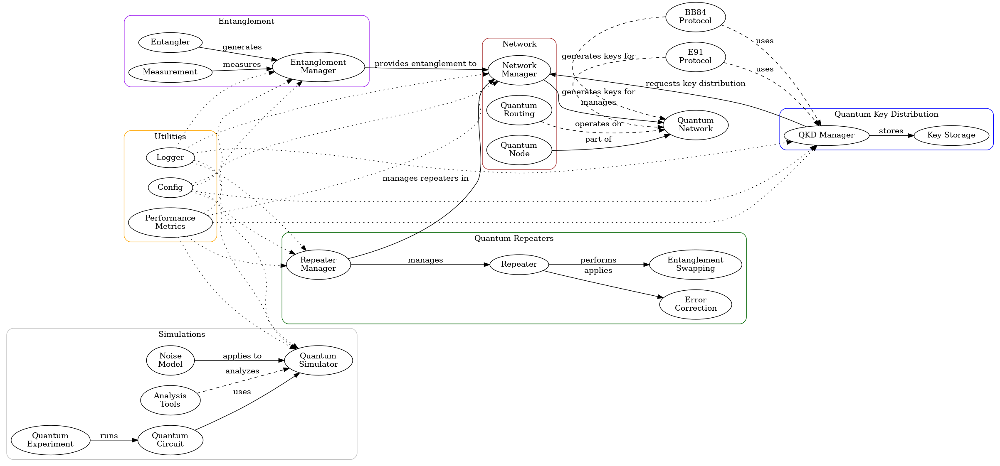

# System Architecture Overview

The Quantum Internet Core is designed with a modular architecture that allows for scalability and flexibility in building quantum communication systems. Below is an overview of the key components and their interactions.

 

## Key Components

1. **Quantum Repeaters**: 
   - Responsible for extending the range of quantum communication by enabling entanglement swapping and error correction.
   - Each repeater can manage multiple entangled pairs and communicate with other repeaters in the network.

2. **Entanglement Generation**:
   - Implements protocols for generating entangled states between quantum nodes.
   - Supports various entanglement generation methods, including Bell-state measurements.

3. **Quantum Key Distribution (QKD)**:
   - Provides secure key exchange methods using quantum mechanics.
   - Implements protocols such as BB84 and E91 for secure communication.

4. **Error Correction**:
   - Ensures data integrity during transmission by correcting errors that may occur due to noise in the quantum channel.
   - Utilizes techniques like quantum error correction codes to maintain fidelity.

5. **Network Management**:
   - Tools for managing the quantum network, including routing quantum information and monitoring network performance.
   - Provides APIs for integrating with classical network management systems.

## Data Flow

The architecture supports a seamless flow of data between components. For instance, when a quantum repeater receives entangled states, it can perform entanglement swapping and then distribute the keys generated through QKD to connected nodes. This modular approach allows for easy updates and enhancements to individual components without disrupting the entire system.

## Conclusion

The Quantum Internet Core's architecture is designed to facilitate research and development in quantum communication, providing a robust framework for building next-generation quantum networks. For more detailed information on each component, please refer to the respective API documentation and usage examples.
